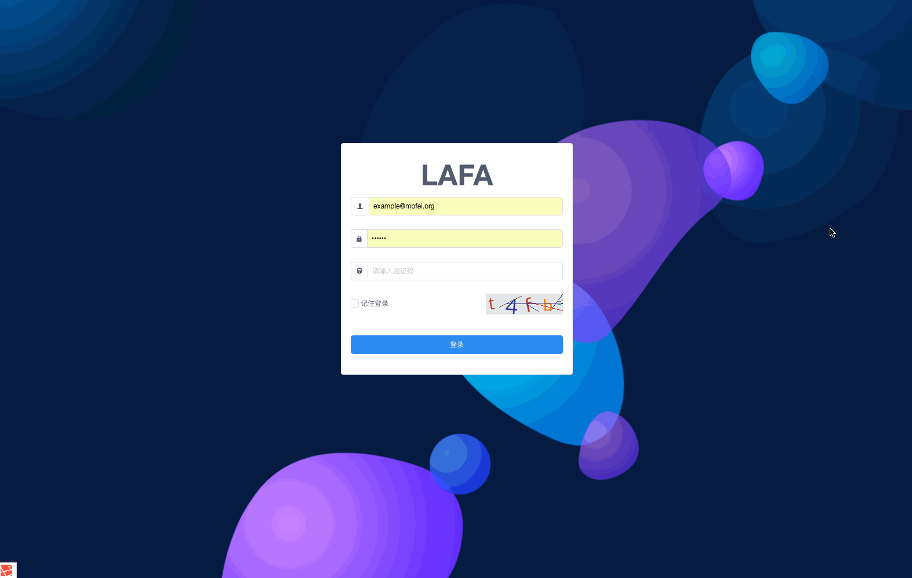

<p align="center">
<a href="https://lafa.mofei.org/">

</a>

<p align="center">⛵<code>拉法</code> 为WEB艺术家打造的Laravel快速开发框架. </p>

<p align="center">
<a href="https://lafa.mofei.org/docs">Documentation</a> |
<a href="https://lafa.mofei.org/docs/zh">中文文档</a> |
<a href="https://demo.lafa.mofei.org">Demo</a> |
<a href="https://github.com/z-song/demo.lafa.mofei.org">Demo source code</a> |
<a href="#extensions">Extensions</a>
</p>
</p>

<center>

[](https://travis-ci.org/laravel/framework)
[](https://packagist.org/packages/mofei/oneone)
[](https://packagist.org/packages/laravel/framework)
[](https://packagist.org/packages/laravel/framework)
[](https://packagist.org/packages/mofei/oneone)

</center>
<p align="center">如果觉得此开源项目不错, 还请多多Star, 以表示鼓励, 作者: 
<a href="https://github.com/imofei" target="_blank">莫非</a>官网: 
<a href="https://lafa.mofei.org" target="_blank">https://lafa.mofei.org</a>
</p>
<p align="center">LAFA是基于 laravel framework 5.7.1 开发的一套前后台快速开发框架，其中包含了管理后台, 用户端前台和 API 服务三部分。</p>

## 环境要求
 - PHP >= 7.1.3
 - Laravel >= 5.7.0
 - Fileinfo PHP Extension

## 安装使用

> LAFA是基于 laravel framework 5.7.1 开发的一套前后台快速开发框架，包含了 管理后台, 前台 和 API 服务三部分。

1. 将lafa代码clone到本地目录.

```
git clone https://github.com/imofei/lafa.git && cd lafa
```

2. 安装laravel5.7及第三方扩展.

```
composer install
```

3. 确保数据库连接设置正确。

```
php artisan migrate
php artisan db:seed
php artisan storage:link
```

打开 `http://localhost/admin/` 使用用户名 `lafa@mofei.org` 密码 `123456` 登录.
## 后台截图

## 前台截图

## 已有功能
- 系统管理
 - 用户管理
 - 权限管理
 - 角色管理
 - 菜单管理
- 站点信息
- 友情链接
- 栏目导航
- 分类管理
- 文章管理
- 页面管理
- 幻灯管理
- 微信公众号管理
- 第三方登录
- 用户端API
- 文章多图，多附件管理
- 集成文件秒传，分片上传
- 自定义表单
- 分词搜索
- 万能表单

License
------------
`LAFA` is licensed under [The MIT License (MIT)](LICENSE).